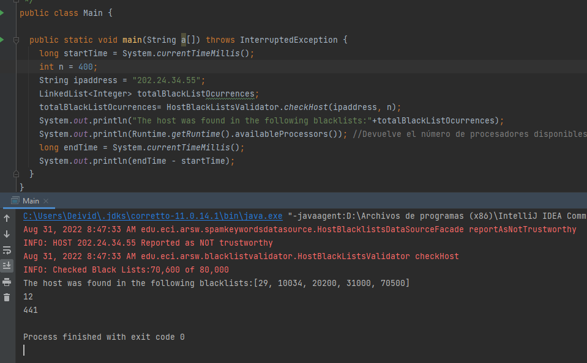
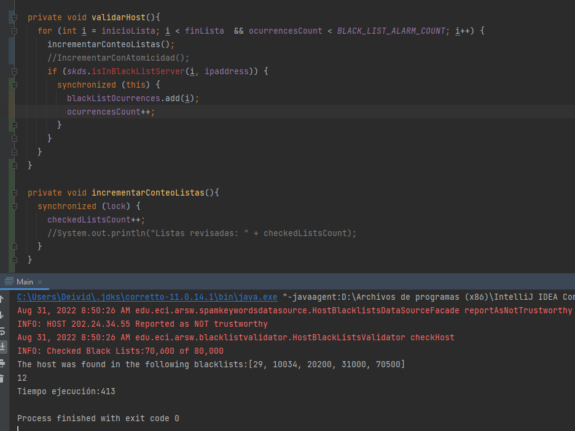
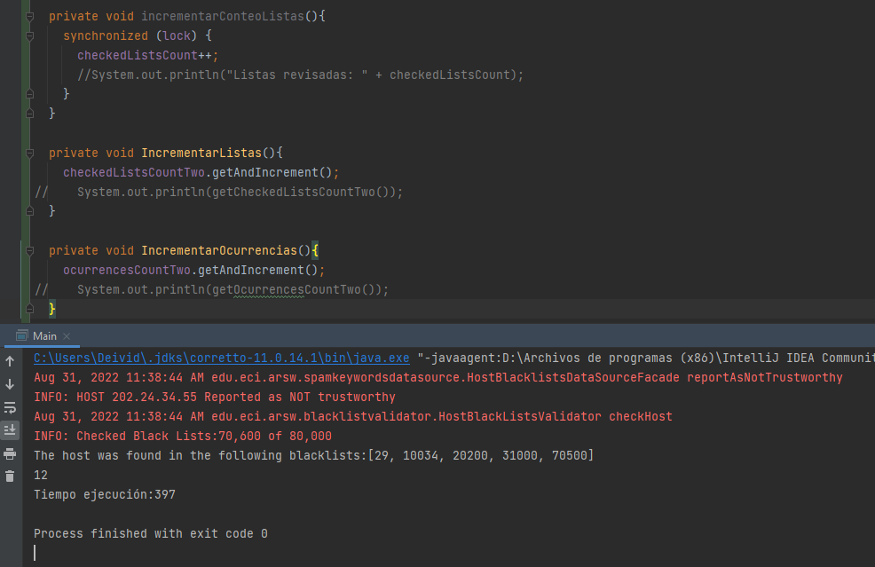

### Escuela Colombiana de Ingeniería
### Arquitecturas de Software - ARSW
## Ejercicio Introducción al paralelismo - Hilos - Caso BlackListSearch
#### Deivid Sebastian Medina Rativa - Cristian Camilo Ruiz Santa.

### Parte I - Sin Hacer ningun Cambio.

En esta primera parte lo que hicimos fue dejar como ya teníamos el laboratorio1. Con el fin de poder
visualizar si hubo un cambio significativo en las listas que se revisaron o el tiempo de ejecución.

Se observa que con 400 hilos, se obtuvo un total de 70600 con un tiempo en milisegundos de 441.

### Parte II - Utilizando synchronized

Para la parte dos. Observamos que se obtuvo el mismo numero de listas revisadas. Pero su tiempo bajo en comparación 
a la primera parte. El cual se obtuvo con una mejora de 6.34% aproximadamente con respecto al tiempo.

### Parte III - Utilizando atomicinteger 

Finalmente se optó por dejar AtomInteger, ya que fue el mejor tiempo, pero las listas revisadas fueron las mismas.
Su mejora fue de 9.97% aproximadamente con respecto al tiempo.

